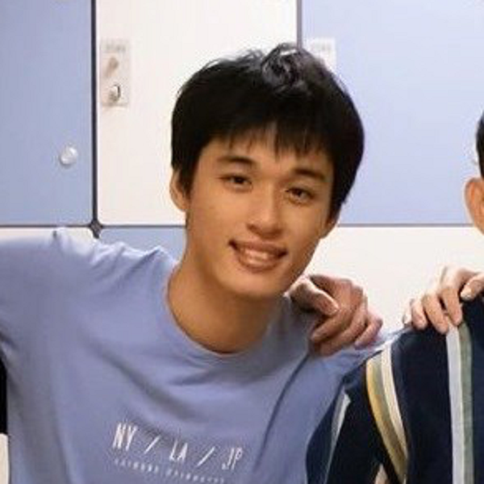
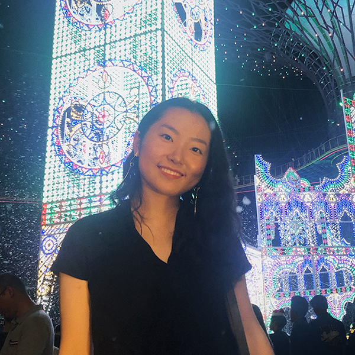
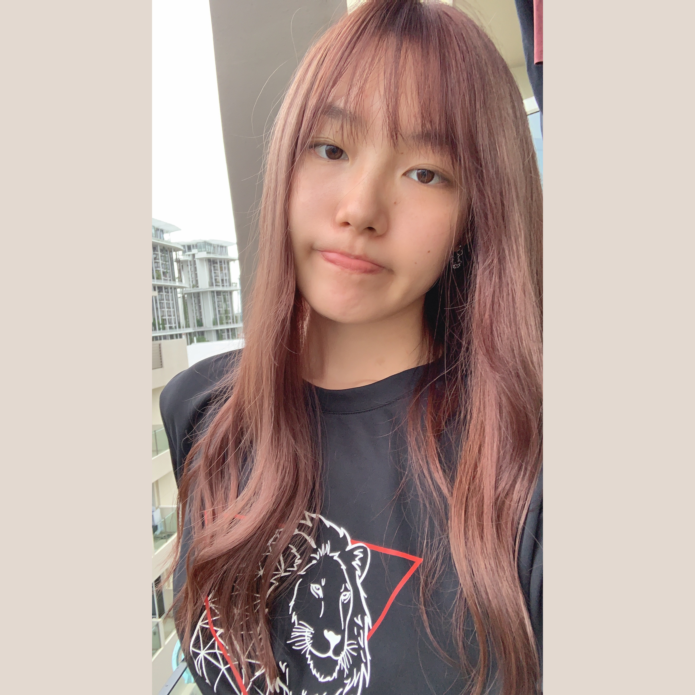
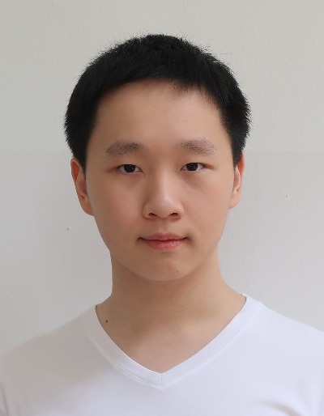

We are a team based in the [School of Computing, National University of Singapore](http://www.comp.nus.edu.sg).

[[Visit our homepage](https://ay2021s1-cs2103t-t15-1.github.io/tp/)]

You can reach us at the email `seer[at]comp.nus.edu.sg`

## Project team

### Tan Yu Li, James

[[github](https://github.com/iamjamestan)]
[[portfolio](team/iamjamestan.md)]

* Role: Project Member

### Lim Dewen Aloysius

[[github](http://github.com/pooty3)]
[[portfolio](team/pooty3.md)]

* Role: Team Member

### Zhang Yifan

[[github](http://github.com/theyifan)] [[portfolio](team/theyifan.md)]

* Role: Team Member
* Responsibilities: Data

### Yao Yuan

[[github](http://github.com/ya0-yuan)]
[[portfolio](team/ya0-yuan.md)]

* Role: Team member
* Responsibilities: Dev Ops + Threading

### Toh Zhen Yu, Nicholas

[[github](http://github.com/nicktohzyu)]
[[portfolio](team/nicktohzyu.md)]

* Role: Developer
* Responsibilities: yes
