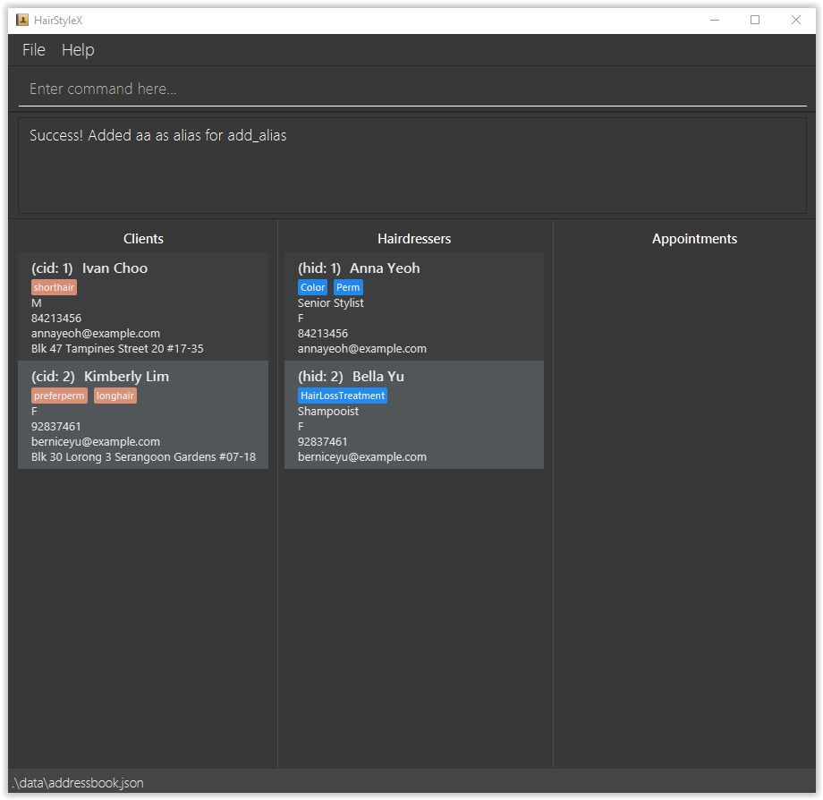
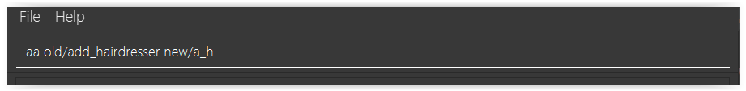
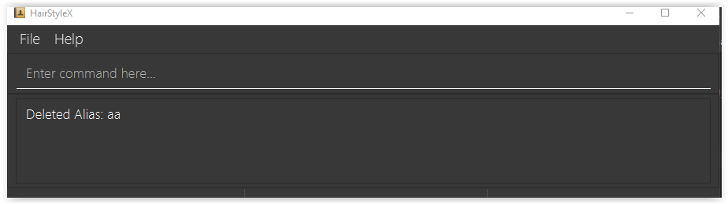

HairstyleX helps managers for budding neighborhood hair salons to manage clients, hairdressers, and appointments. It is optimized for CLI users so that frequent tasks can be done faster by typing in commands.
* Table of Contents
{:toc}

--------------------------------------------------------------------------------------------------------------------

## Quick start

1. Ensure you have Java `11` or above installed in your Computer.

1. Download the latest `HairStyleX.jar` from [here](https://github.com/AY2021S1-CS2103T-T15-1/tp/releases).

1. Copy the file to the folder you want to use as the _home folder_ for your HairStyleX.

1. Double-click the file to start the app. The GUI similar to the below should appear in a few seconds. Note how the app contains some sample data. 
   

1. Type the command in the command box and press Enter to execute it. e.g. typing **`help`** and pressing Enter will open the help window. 

1. Refer to the [Features](#features) below for details of each command.

--------------------------------------------------------------------------------------------------------------------

## Features

**:information_source: Notes about the command format:** 

* Words in `UPPER_CASE` are the parameters to be supplied by the user. 
  e.g. in `add n/NAME`, `NAME` is a parameter which can be used as `add n/John Doe`.

* Items in square brackets are optional. 
  e.g `n/NAME [t/TAG]` can be used as `n/John Doe t/friend` or as `n/John Doe`.

* Items with `…`​ after them can be used multiple times including zero times. 
  e.g. `[t/TAG]…​` can be used as ` ` (i.e. 0 times), `t/friend`, `t/friend t/family` etc.

* Parameters can be in any order. 
  e.g. if the command specifies `n/NAME p/PHONE_NUMBER`, `p/PHONE_NUMBER n/NAME` is also acceptable.

### General commands

#### Viewing help : `help`

Shows the link to the user guide in case the user forgets the commands.

#### Clearing all entries : `clear`

Clears all entries from the application.

Format: `clear`

#### Exiting the program : `exit`

Exits the program.

Format: `exit`

#### Saving the data

All hairdressers and client information will be stored automatically after any command that changes the data. There is no need to save manually. Will be loaded upon restart of the application.

### Appointment commands

#### Adding an appointment : `add_appt`

Adds an appointment to the database.

Format: `add_appt cid/CLIENT_ID hid/HAIRDRESSER_ID d/DATE t/TIME`
* `DATE` must be entered in YYYY-MM-DD format
* `TIME` must be entered in 24 Hour HH:MM format

Examples:
* `add_appt cid/1 hid/1 d/2020-12-12 t/17:30`

#### Listing all appointments : `list_appt`

Shows a list of all appointments in the database.

Format: `list_appt`

#### Editing an appointment : `edit_appt`

Edits an existing appointment in the database.

Format: `edit_appointment ID s/STATUS`

* Edits the appointment with the specified `ID`. The index refers to the index number shown in the displayed appointment list. The index **must be a positive integer** 1, 2, 3, …​
* Only the status of the appointment can be updated.
* All appointments are active by default.

Examples:
*  `edit_appt 1 s/CANCELLED` Edits the status of the first appointment to be CANCELLED.

#### Deleting an appointment : `delete_appt`

Removes a specific appointment from the database.

Format: `delete_appt ID`

* Deletes the appointment with the specified `ID`.
* The index refers to the index number shown in the displayed appointment list.
* The index **must be a positive integer** 1, 2, 3, …​

### Client commands

#### Adding a client : `add_client`

Adds a client to the database.

Format: `add_client n/NAME p/PHONE_NUMBER e/EMAIL g/GENDER a/ADDRESS [t/TAG]…​`

Examples:
* `add_hairdresser n/John Doe p/98765432 e/johnd@example.com a/John street, block 123, #01-01 ti/senior_stylist`
* `add_client n/John Doe p/98765432 e/johnd@example.com g/M a/311, Clementi Ave 2, #02-25 t/friends t/owesMoney`

#### Listing all clients : `list_client`

Shows a list of all clients in the database.

Format: `list_client`

#### Editing a client : `edit_client`

Edits an existing client in the database.

Format: `edit_client ID [n/NAME] [p/PHONE] [e/EMAIL] [g/GENDER] [a/ADDRESS] [t/TAG]…​`

* Edits the client with the specified `ID`. The index refers to the index number shown in the displayed client list. The index **must be a positive integer** 1, 2, 3, …​
* At least one of the optional fields must be provided.
* Existing values will be updated to the input values.
* When editing tags, the existing tags of the client will be removed i.e adding of tags is not cumulative.
* You can remove all the client’s tags by typing `t/` without
    specifying any tags after it.

Examples:
*  `edit_client 1 p/91234567 e/yy@example.com` Edits the phone number and email address of the 1st client to be `91234567` and `yy@example.com` respectively.
*  `edit_client 2 n/Betsy Crower t/` Edits the name of the 2nd client to be `Betsy Crower` and clears all existing tags.

#### Deleting a client : `delete_client`

Removes a specific client from the database.

Format: `delete_client ID`

* Deletes the client with the specified `ID`.
* The index refers to the index number shown in the displayed client list.
* The index **must be a positive integer** 1, 2, 3, …​
* All appointments with this corresponding client will now show "DELETED" for the client placeholder

### Hairdresser commands

#### Adding a hairdresser : `add_hairdresser`

Adds a hairdresser to the database.

Format: `add_hairdresser n/NAME p/PHONE_NUMBER e/EMAIL g/GENDER ti/TITLE [s/SPECIALISATION]…​`

#### Listing all hairdressers : `list_hairdresser`

Shows a list of all hairdressers in the database.

Format: `list_hairdresser`

Format: `list_client`

#### Editing a hairdresser : `edit_hairdresser`

Edits an existing hairdresser in the database.

Format: `edit_hairdresser ID [n/NAME] [p/PHONE] [e/EMAIL] [e/GENDER] [ti/TITLE] [s/SPECIALISATION]…​`

* Edits the hairdresser with the specified `ID`. The index refers to the index number shown in the displayed hairdresser list. The index **must be a positive integer** 1, 2, 3, …​
* At least one of the optional fields must be provided.
* Existing values will be updated to the input values.
* When editing specialisations, the existing specialisations of the hairdresser will be removed i.e adding of specialisations is not cumulative.
* You can remove all the hairdresser’s tags by typing `s/` without
    specifying any specialisations after it.

Examples:
*  `edit_hairdresser 1 p/91234567 e/yy@example.com` Edits the phone number and email address of the 1st hairdresser to be `91234567` and `yy@example.com` respectively.
*  `edit_hairdresser 2 n/Betsy Crower s/` Edits the name of the 2nd hairdresser to be `Betsy Crower` and clears all existing specialisations.

#### Deleting a hairdresser : `delete_hairdresser`

Removes a specific hairdresser from the database.

Format: `delete_hairdresser ID`

* Deletes the hairdresser with the specified `ID`.
* The index refers to the index number shown in the displayed hairdresser list.
* The index **must be a positive integer** 1, 2, 3, …​
* All appointments with this corresponding hairdresser will now show "DELETED" for the hairdresser placeholder

### Alias commands
(Contributed by Aloysius)

This feature allows you to customise shortcuts. You can add, delete and list shortcuts for 
longer commands.

#### Add a new alias : `add_shortcut`

You can use this command to add a new shortcut to the program.

*Format:*

`add_shortcut old/OLD_SHORTCUT new/NEW_SHORTCUT`

*Example:*

You want to create an alias `aa` for `add_shortcut`. 

****
Creating a new alias:

. Type `add_shortcut old/add_shortcut new/aa` into the _Command Box_.
. Press `Enter` to execute.

Outcome:

. The _Result Display_ will show a success message.
. You can now see your new shortcut
****

.Outcome of a successful `add_shortcut` command

***

You can now use the shortcut

***

And it works!

** :information_source: You cannot add duplicate shortcuts or default command words as shortcuts** 

#### Delete an alias : `delete_shortcut`

You can use this command to delete an shortcut to the program.

*Format:*

`delete_shortcut SHORTCUT`

*Example:*

You want to delete a shortcut `aa`. 

****
Deleting an alias:

. Type `delete_shortcut aa` into the _Command Box_.
. Press `Enter` to execute.

Outcome:

. The _Result Display_ will show a success message.
****

.Outcome of a successful `delete_shortcut` command

***

####  List all alias : `listshortcut`

You can use this command to list all your shortcuts.

*Format:*

`list_shortcut`

[Coming soon]
--------------------------------------------------------------------------------------------------------------------

## Command summary

Action | Format, Examples
--------|------------------
**Help** | `help`
**Clear** | `clear`
**Exit** | `exit`
**Add Hairdresser** | `add_hairdresser n/NAME p/PHONE_NUMBER e/EMAIL ti/TITLE [s/SPECIALISATION] [t/TAG]…​`   e.g., `add n/James Ho p/22224444 e/jamesho@example.com ti/senior s/colouring t/colleague`
**Add Client** | `add_client n/NAME p/PHONE_NUMBER e/EMAIL a/ADDRESS tr/TREATMENT [p/PREFERENCE] [t/TAG]…​`   e.g., `add n/Nicholas Toh p/12345678 e/niktoh@example.com a/123, Clementi Rd, 1234665 tr/colouring p/female stylist t/frequent`
**Add Appointment** | `add_appt cid/CLIENT_ID hid/HAIRDRESSER_ID d/DATE t/TIME`   e.g., `add_appt cid/1 hid/1 d/2020-12-12 t/17:30`
**List Hairdressers** | `list_hairdresser`
**List Clients** | `list_client`
**List Appointments** | `list_appt`
**Edit Hairdresser** | `edit_hairdresser ID ID [n/NAME] [p/PHONE_NUMBER] [e/EMAIL] [ti/TITLE] [s/SPECIALISATION] [t/TAG]…​`  e.g.,`edit_hairdresser 2 n/James Lee ti/senior`
**Edit Client** | `edit_client ID [n/NAME] [p/PHONE_NUMBER] [e/EMAIL] [a/ADDRESS] [tr/TREATMENT] [p/PREFERENCE] [t/TAG]…​`  e.g.,`edit_client 2 n/James Tan p/Female Stylist`
**Edit Appointment** | `edit_appointment ID s/STATUS`   e.g.,`edit_appt 1 s/CANCELLED`
**Delete Hairdresser** | `delete_hairdresser ID`   e.g., `delete_hairdresser 3`
**Delete Client** | `delete_client ID`   e.g., `delete_client 3`
**Delete Appointment** | `delete_appt ID`   e.g., `delete_appt 3`
