

* Table of Contents
{:toc}

--------------------------------------------------------------------------------------------------------------------

## 1. Introduction
(Contributed by Tan Yu Li, James)

Welcome to the User Guide of **HairStyleX**.
 
Today, many budding hair salons still resort to using pen and paper to keep track of their appointments, clients, and hairdressers due to their tight budget. While suitable for a small client base, this is not sustainable in the long run as their client base increases, since recording and searching for information manually would be slow and prone to human errors. Our salon management application **HairStyleX** is designed to make this process much easier for salon managers who have at least a laptop at their front desk.

This application uses a Command Line Interface (CLI); this means that you operate the application by typing commands into a Command Box. If you are fast at typing, you can manage your appointments faster than other Graphical User Interface (GUI) applications; GUI applications allow users to interact with the application through graphical icons such as buttons.

The purpose of this user guide is to provide you with an in-depth documentation on how to install and use our application. What are you waiting for? Head on to [Section 2, “Quick Start”](#2-quick-start) .

--------------------------------------------------------------------------------------------------------------------

## 2. Quick Start

To get started with using **HairStyleX**, you can follow these steps:

1. Ensure you have Java `11` or above installed in your Computer.

1. Download the latest `HairStyleX.jar` from [here](https://github.com/AY2021S1-CS2103T-T15-1/tp/releases).

1. Copy the file to the folder you want to use as the _home folder_ for **HairStyleX**.

1. Double-click the file to start the app. The GUI similar to the one shown below should appear in a few seconds. Note how the app contains some sample data. 

1. At the top of the screen, type the command in the command box and press Enter to execute it. e.g. typing **`help`** and pressing Enter will open the help window. 

1. Refer to [Section 3.2.3, "Command Syntax and Usage"](#323-command-syntax-and-usage) on how to use commands and [Section 4, "Features"](#4-features) below for details of each command.

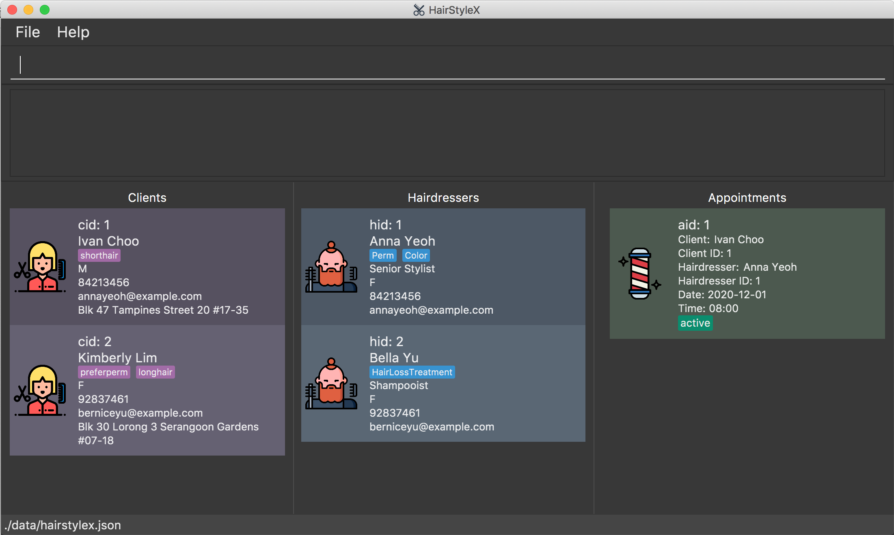

--------------------------------------------------------------------------------------------------------------------

## 3. About

(Contributed by Tan Yu Li, James)

### 3.1 Structure of this document

There are many things you can do with **HairStyleX**. Thus, we have structured this User Guide in such a way that you can easily find what you need. In the next subsection, [Section 3.2, “Reading this Document”](#32-reading-this-document), you will find useful tips on reading this document. It is then followed by [Section 4, “Features”](#4-features) where the four main features of **HairStyleX** and their commands are documented:

* Client Management

* Hairdresser Management

* Appointment Management

* Shortcut Management

### 3.2 Reading this document

Before moving on to the next section, you may want to familiarise yourself with some technical terms, symbols and syntax that are used throughout the document. In this subsection, you can find all the information you need to know when reading this document.

#### 3.2.1 Terminology related to the Graphical User Interface (GUI)

The following figure shows the GUI of **HairStyleX**. It is annotated with the name of the GUI components.

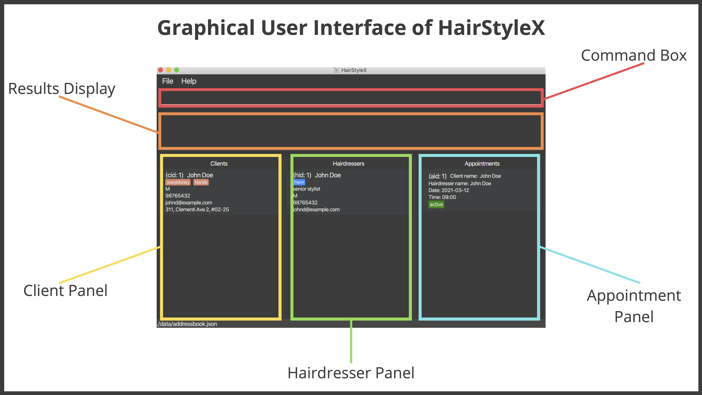

#### 3.2.2 General Symbols and Syntax

The table below explains the general symbols and syntax used throughout the document.

**Symbol/Syntax** | **Meaning**
--------|------------------
`command` | A light blue highlight (called a code-block markup) indicates that this is a command that can be typed into the command box and executed by the application.
:information_source: | An information icon indicates that the enclosed text are notes regarding this section.
:warning: | A warning sign indicates that the enclosed text is important, and usually entails details about potential errors.
:bulb: | A light bulb indicates that the enclosed text is a tip.

#### 3.2.3 Command Syntax and Usage

Since **HairStyleX** is a CLI application, knowing how to use commands is very important. The following subsection will teach you how to read and use commands in **HairStyleX**. All commands in **HairStyleX** follow similar formats as described below and examples will be provided to help you understand their usage. Examples of commands and their formats will be written in `code-blocks`.

The table below explains some important technical terms. An example will be provided to help you visualize these terms.

**Technical Term** | **Meaning**
--------|------------------
Command word | 	The first word of a command. It determines the action that **HairStyleX** should perform.
Parameter | The word or group of words following the command word. They are values given to a command to perform the specified action.
Prefix | The letter(s) that at the start of a parameter. It distinguishes one parameter from another.

Breakdown:

Command Word - `add_hairdresser`

Parameters - `NAME`, `PHONE`, `EMAIL`

Prefix - `n/`, `p/`, `e/`

The following four points explain how you can use a command with the provided format. More examples will be provided for each command in [Section 4, “Features”](#4-features).

1. Words in the upper case are the parameters which are required.

    * Format given: `delete_client CLIENT_ID`
    
    * Acceptable input: `delete_client 1`

1. Items in square brackets are optional.

    * Format given: `edit_client ID [n/NAME] [p/PHONE] [e/EMAIL] [g/GENDER] [a/ADDRESS] [t/TAG]…`
    
    * Acceptable input: `edit_client 1 n/Aileen e/aileenlam@email.com`
    
1. Items with `…` after them can be used zero or multiple times.

    * Format given: `add_client n/NAME p/PHONE_NUMBER e/EMAIL g/GENDER a/ADDRESS [t/TAG]…`
    
    * Acceptable input 1 (no tags): `add_client n/John Doe p/98765432 e/johnd@example.com g/M a/311, Clementi Ave 2, #02-25`
    
    * Acceptable input 2: (two tags): `add_client n/John Doe p/98765432 e/johnd@example.com g/M a/311, Clementi Ave 2, #02-25 t/friends t/owesMoney`
    
1. Parameters with prefixes can be supplied in any order.

    * Format given: `add_client n/NAME p/PHONE_NUMBER e/EMAIL g/GENDER a/ADDRESS [t/TAG]…`
    
    * Acceptable input 1 (same order as given format): `add_client n/John Doe p/98765432 e/johnd@example.com g/M a/311, Clementi Ave 2, #02-25 t/friends`
    
    * Acceptable input 2 (different order as given format): `add_client p/98765432 e/johnd@example.com n/John Doe g/M a/311, Clementi Ave 2, #02-25 t/friends`
    
With the above information, you can now move on to [Section 4, Features](#4-features) to learn all the features of the application and start using the commands.
    
--------------------------------------------------------------------------------------------------------------------

## 4. Features

This section contains all the information you need to know about the features of **HairStyleX**. To use each feature or sub-feature, you will need to enter the command into the Command Box.

**:warning: Warning about the use of features:** 

As you use our features, other files will be created and stored in the folder that contains **HairStyleX.jar**. These files are created with the purpose of storing your data. Please do not alter or delete any of them, as this might result in permanent loss of data.

**:information_source: Saving the data**

All information will be stored automatically after any command that changes the data. There is no need to save manually. This data be automatically loaded upon restart of the application.

**:bulb: Tips for first time users** 

If this is your first time using **HairStyleX**, you might notice that this application is pre-filled with sample data. To delete all data, use the `clear` command as stated below.

### 4.1 General commands
(Contributed by Tan Yu Li, James)

The commands in this section allow you to perform operations on the entire system. They include:

* Viewing help
* Clearing all entries
* Exiting from the application
* Exporting entries to CSV

#### 4.1.1 Viewing help : `help`

You can use this command to view the user guide, which contains information about all the instructions in **HairStyleX**.

:information_source: Ensure that you have a stable internet connection and have a web browser on your computer in order to access the user guide.

**Format:**

`help`

**Example:**

In this example, you want to view the user guide to get information about the various commands in **HairStyleX**.

Requesting for help:

1. Type `help` into the *Command Box*.
1. Press `Enter` to execute.
1. A new window will appear. Click on the `Copy URL` button to copy the URL containing the **HairStyleX** user guide.
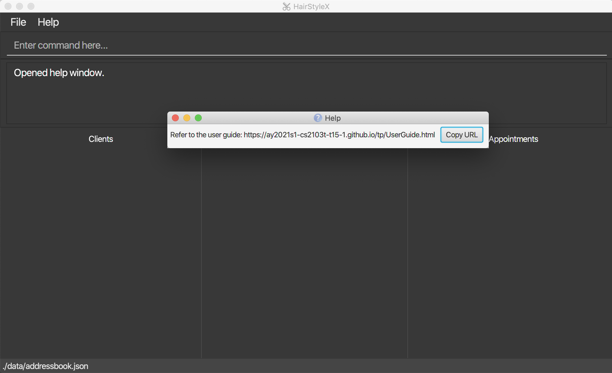
1. Open your preferred web browser on your computer and paste the link into the address bar.
1. Press `Enter` to load the website

Outcome:

1. Your browser will show the user guide
1. You can now access information about all commands in **HairStyleX** via the browser

#### 4.1.2 Clearing all entries : `clear`

You can use this command to clear all entries in **HairStyleX**.

**:warning: This command will delete all data in HairStyleX permanently. Please proceed with caution.**

**Format:**

`clear`

**Example:**

In this example, you want to clear all current data and start with an empty **HairStyleX**.

Clearing the data:

1. Type `clear` into the *Command Box*.
1. Press `Enter` to execute.

Outcome:

1. The `Result Display` will show a success message.
1. You will now see that the *Clients Panel*, *Hairdressers Panel*, and *Appointments Panel* are empty.

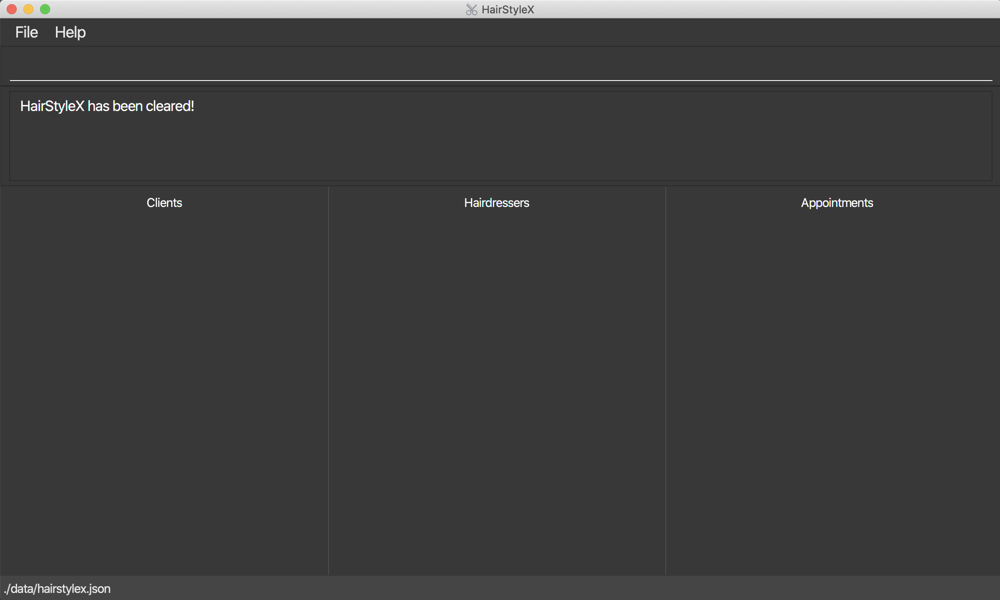

#### 4.1.3 Exiting from the application: `exit`

You can use this command to exit **HairStyleX**.

**:information_source: This command will exit the application immediately. All data is saved automatically and will be reloaded upon restart of the application**

**Format:**

`exit`

**Example:**

In this example, you want to exit **HairStyleX**.

Exiting the application:

1. Type `exit` into the *Command Box*.
1. Press `Enter` to execute.

Outcome:

1. The **HairStyleX** application window is now closed.

#### 4.1.4 Exporting entries to CSV: `print`

You can use this command to export all hairdressers, clients and appointments from the application to CSV files.

**:information_source: Modifying the CSV files generated will not result in changes to the data in HairStyleX**

**Format:**

`print`

**Example:**

In this example, you want to export all current data into CSV files.

Exporting to CSV:

1. Type `print` into the *Command Box*.
1. Press `Enter` to execute.

Outcome:

1. The `Result Display` will show a success message.
1. You can now access the CSV files in the folder `data` that is in the same directory with **HairStyleX.jar**.
1. There should be three CSV files generated. Namely, *appointments.csv*, *clients.csv*, *hairdressers.csv*.
1. These files contain the information for `Appointment`s, `Client`s, and `Hairdresser`s respectively. 

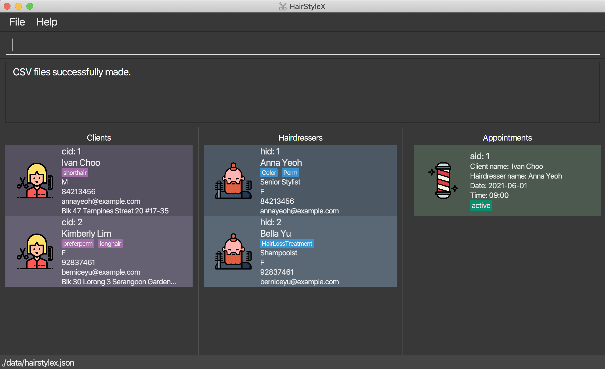

### 4.2 Client Management
(Contributed by Yao Yuan)

This feature allows you to manage the information of clients in your salon. You can record the following information about clients:

* Name
* Gender
* Phone
* Email
* Address
* Tags

#### 4.2.1 Client Management Command Parameters
Before you jump right into using this feature, you may want to learn about all the common command parameters used in this feature. The table below shows the list of common command parameters that will be used for this feature.

Parameter Name | Description
---------------|-------------
`NAME` | The name of the client.  It should only contain at most 50 alphanumeric characters and spaces, and it should not be blank.   E.g. `Yao Yuan`
`PHONE` | The phone number of the client.   It should only contain numbers, should be at least 3 digits long, and should be at most 15 digits   E.g. `96757525`
`EMAIL` | The email of the client. Emails should be of the format local-part@domain and adhere to the following constraints:  1. The local-part should only contain alphanumeric characters and these special characters: `!#$%&'*+/=?{}~^.-` . 2. This is followed by a '@' and then a domain name. The domain name must be at least 2 characters long, start and end with alphanumeric characters, consist of alphanumeric characters, a period or a hyphen for the characters in between, if any. The entire email should be at most 50 characters long.  E.g. `yaoyuan@example.com`
`GENDER` | The gender of the client.   Gender should be either F or M or f or m.   E.g. `F`
`ADDRESS` | The address of the client. It should only contain a maximum of 50 characters    E.g. `6 College Avenue East #12-01D`
`TAG` | The tag of the client.   A tag can only be one word with no space in between.   It should only contain at most 20 alphanumeric characters.   It is optional.   There can be more than one tag for each client.   E.g. `shortHair`
`ID` | The unique client ID `cid` that is assigned to each client.  The ID is unique to each client, and the ID will not be assigned to another client even if one is deleted from the database.  Thus, the ID displayed in the list may not be sequential. 
`KEYWORD` | Keyword for `filter_client`.  It should only contain alphanumeric characters. 

#### 4.2.2 Adding a client: `add_client`

You can use this command to add a client to the database.

**Format:**

`add_client n/NAME p/PHONE e/EMAIL g/GENDER a/ADDRESS [t/TAG]…`

:information_source: Refer to [Section 4.2.1](#421-client-management-command-parameters) for more details on each parameter.

:warning:

* Clients with the same name and phone number are considered as duplicates.

* Likewise, a client with the same name and phone number as an existing hairdresser is also considered as a duplicate.

* You are not allowed to enter duplicates into **HairStyleX**.

**Examples:**

In the example below, you will register a male client called **John Doe** with phone number **98765432**, email **johnd@example.com**, address **311, Clementi Ave 2, #02-25**, who has short hair and owes the salon money, into the HairstyleX.

* `add_client n/John Doe p/98765432 e/johnd@example.com g/M a/311, Clementi Ave 2, #02-25 t/shortHair t/owesMoney`

Adding a new client:  

1. Type `add_client n/John Doe p/98765432 e/johnd@example.com g/M a/311, Clementi Ave 2, #02-25 t/shortHair t/owesMoney` into the *Command Box*.
1. Press `Enter` to execute.

Outcome:  

1. The `Result Display` will show a success message. 
1. You can now see the client's information in the *Clients Panel*.

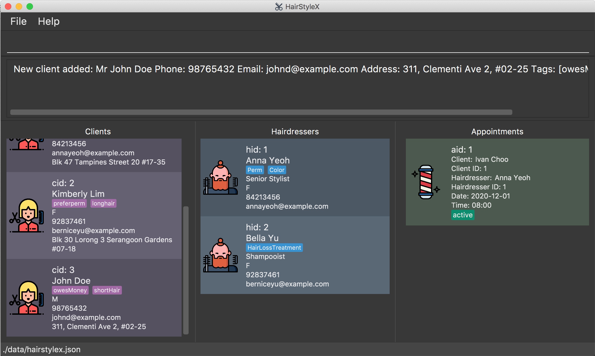

#### 4.2.3 Listing all clients : `list_client`

You can use this command to show a list of all clients in the database. This command is especially useful if you used `filter_client` command to search for clients- `list_client` will restore the full list to view. 

**Format:**

`list_client`

**Example:**

Listing all your clients:

1. Type `list_client` into the *Command Box*.
1. Press `Enter` to execute.

Outcome:

1. The Result Display will show a success message.
1. You can now see all your clients in the *Client Panel*.

#### 4.2.4 Editing a client : `edit_client`

You can use this command to edit an existing client in the database.

**Format:**
 
`edit_client ID [n/NAME] [p/PHONE] [e/EMAIL] [g/GENDER] [a/ADDRESS] [t/TAG]…`

:information_source: 
* Edits the client with the specified `ID`. The index refers to the index number `cid` shown in the displayed client list. The index **must be a positive integer** 1, 2, 3, …
* At least one of the optional fields must be provided.
* Existing values will be updated to the input values.
* When editing tags, the existing tags of the client will be removed i.e adding of tags is not cumulative.
* You can remove all the client’s tags by typing `t/` without
    specifying any tags after it.
* Refer to [Section 4.2.1](#421-client-management-command-parameters) for more details on each parameter.

:warning:

* Clients with the same name and phone number are considered as duplicates.

* Likewise, a client with the same name and phone number as an existing hairdresser is also considered as a duplicate.

* You are not allowed to edit a client such that their updated information results in duplicates in **HairStyleX**.

**Examples:**

Assume that the client with ID `1` changed his/her phone number and email and you wish to update it in the database. You will perform the following steps:

Editing a new client:

1. Type `edit_client 1 p/91234567 e/yy@example.com` into the *Command box*.
1. Press `Enter` to execute.

Outcome:

1. The `Result Display` will show a success message. 
1. You can now see the updated client's information in the *Clients Panel*.

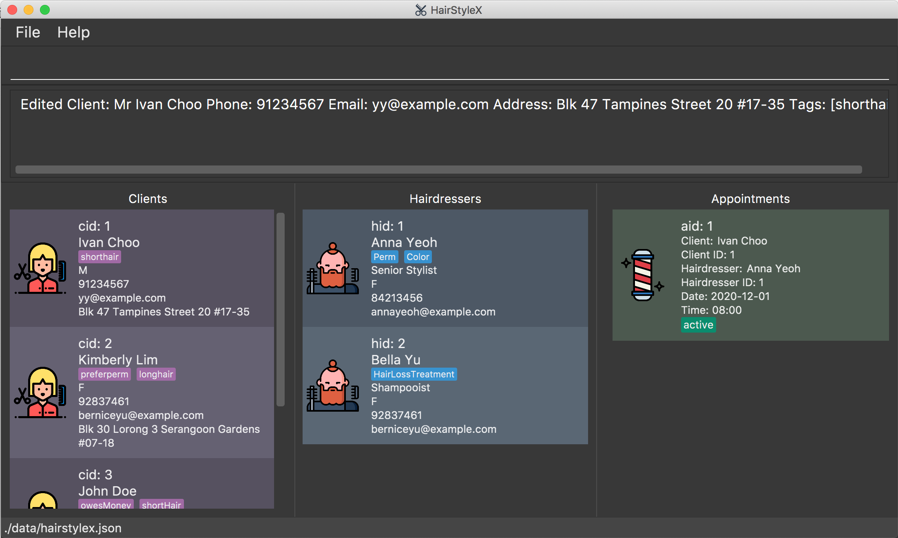

#### 4.2.5 Deleting a client : `delete_client`

You can use this command to remove a specific client from the database.

**Format:**

`delete_client ID`

:information_source: 
* Deletes the client with the specified `ID`.
* The index refers to the index number `cid` shown in the displayed client list.
* The index **must be a positive integer** 1, 2, 3, …
* All appointments with this corresponding client will now show "DELETED" for the client placeholder
* The purpose of deletion is to remove personal information such as name, phone number, and email. Other information such as the `ID` and associated appointments may still be preserved.

**Example:**

Assume that the information of client with ID `2` is no longer needed and you wish to delete him/her from the database. You will perform the following steps:

Delete client:  

1. Type `delete_client 2` into the *Command Box*.
1. Press `Enter` to execute.

Outcome:  

1. The `Result Display` will show a success message.

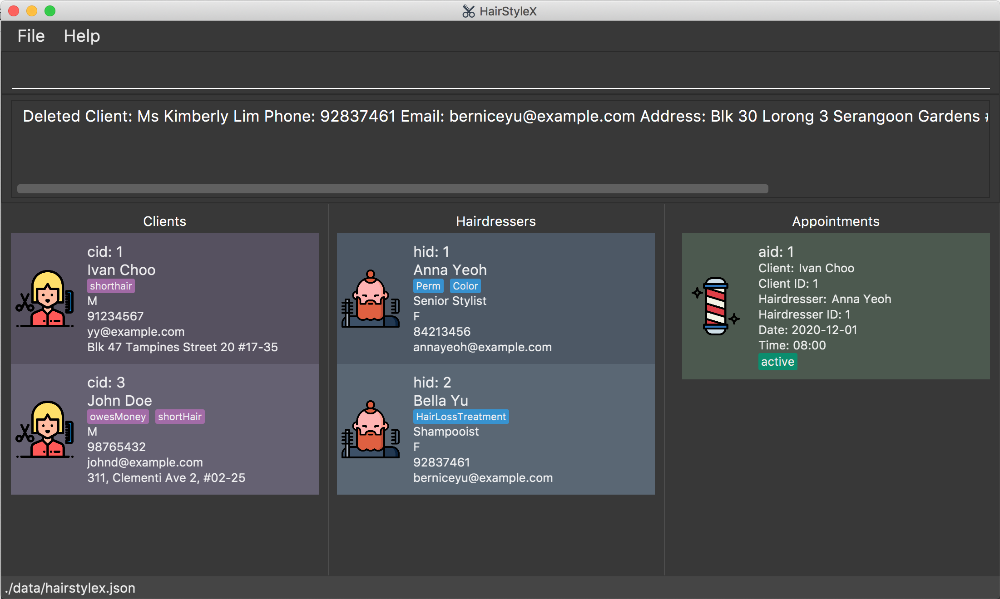

#### 4.2.6 Filtering clients : `filter_client`

You can filter the list of clients in the database by keyword search that match their names.

**Format:**

 `filter_client KEYWORD...`

:information_source: 
* The search is case-insensitive. e.g `anna`, `aNNa` will match `Anna`.
* The order of the keywords does not matter. e.g. `Anna Yeoh` will match `Yeoh Anna`.
* Only the name is searched.
* Only full words will be matched e.g. `Ann` will not match `Anna`.
* Persons matching at least one keyword will be returned (i.e. `OR` search). e.g. `Anna Yeoh` will return `Anna Cheung`, `David Yeoh`.

**Example:**

You wish to find the client **Ivan** from the database and check his phone number. You will perform the following steps:

Filter clients:  

1. Type `filter_client ivan` into the *Command Box*.
1. Press `Enter` to execute.

Outcome:  

1. The `Result Display` will show a success message.
1. You can now see the filtered client's information in the *Clients Panel*, with clients named `Ivan` displayed in the list.

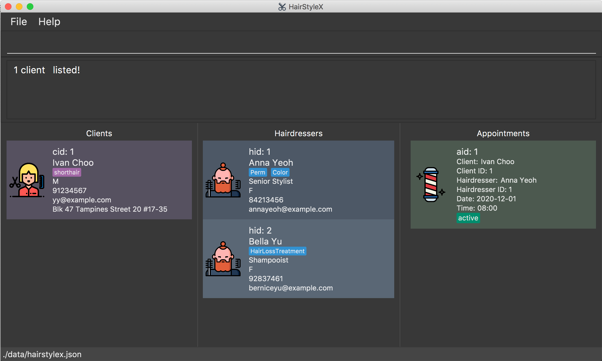

### 4.3 Hairdresser Management

(contributed by Zhang Yifan)

This feature allows you to manage the information of hairdressers in your salon. You can record the following information about hairdressers: 
* Name
* Title
* Gender
* Phone
* Email
* Specialisations

#### 4.3.1 Hairdresser Management Command Parameters

Parameter Name | Description
--------|------------------
`NAME` | The name of the hairdresser. It should only contain at most 50 alphanumeric characters and spaces, and it should not be blank. E.g. `Anna Sue`
`TITLE` | The title of the hairdresser. It should only contain at most 20 alphanumeric characters and spaces, and it should not be blank. E.g. `Senior Stylist`
`GENDER` | The gender of the hairdresser. Gender should be either F or M or f or m. E.g. `F`
`PHONE` | The phone number of the hairdresser. Phone numbers should only contain numbers, should be at least 3 digits long, and should be at most 15 digits long. E.g. `81526354`
`EMAIL` | The email of the hairdresser. Emails should be of the format local-part@domain and adhere to the following constraints:  1. The local-part should only contain alphanumeric characters and these special characters: `!#$%&'*+/=?{}~^.-` . 2. This is followed by a '@' and then a domain name. The domain name must be at least 2 characters long, start and end with alphanumeric characters, consist of alphanumeric characters, a period or a hyphen for the characters in between, if any. The entire email should be at most 50 characters long.  E.g. `johnd@example.com`
`SPECIALISATION` | The specialisation of the hairdresser. Specialisations should be one of the following options and are case-sensitive:  `Color`, `Perm`, `HairExtension`, `Styling`, `HairConditioning`, `Straightening`, `ScalpTreatment`, `HairLossTreatment`. E.g. `Color`
`ID` | The unique hairdresser ID `hid` that is assigned to each hairdresser.  The ID is unique to each hairdresser, and the ID will not be assigned to another hairdresser even if one is deleted from the database.  Thus, the ID displayed in the list may not be sequential. 
`KEYWORD` | Keyword for `filter_hairdresser`.  It should only contain alphanumeric characters. 

#### 4.3.2 Adding a hairdresser : `add_hairdresser`

You can use this command to add a hairdresser to the database.

**Format:**

`add_hairdresser n/NAME p/PHONE e/EMAIL g/GENDER ti/TITLE [s/SPECIALISATION]…`

:information_source: Refer to [Section 4.3.1](#431-hairdresser-management-command-parameters) for more details on each parameter.

:warning:

* Hairdressers with the same name and phone number are considered as duplicates.

* Likewise, a hairdresser with the same name and phone number as an existing client is also considered as a duplicate.

* You are not allowed to enter duplicates in **HairStyleX**.

**Example:**

In the example below, you will register a female Senior Stylist called **Helen Lim** with phone number **82716252**, email **helenlim@example.com**, who is specialised in **Perm** and **Color**, into the HairstyleX.

Adding a new hairdresser:  

1. Type `add_hairdresser n/Helen Lim p/82716252 e/helenlim@example.com g/F ti/Senior Stylist s/Perm s/Color` into the *Command Box*.
1. Press `Enter` to execute.

Outcome:  

1. The `Result Display` will show a success message. 
1. You can now see the hairdresser's information in the *Hairdressers Panel*.

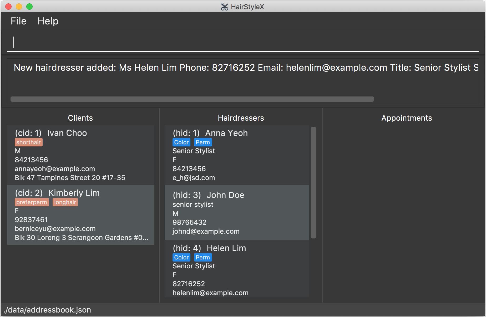

#### 4.3.3 Listing all hairdressers : `list_hairdresser`

You can use this command to show a list of all hairdressers in the database. This command is especially useful if you used `filter_hairdresser` command to search for hairdressers- `list_hairdresser` will restore the full list to view. 

**Format:**

`list_hairdresser`

**Example:**

Listing all hairdressers:  

1. Type `list_hairdresser` into the *Command Box*.
1. Press `Enter` to execute.

Outcome:  

1. The `Result Display` will show a success message. 
1. You can now see a list of all hairdresser's information in the *Hairdressers Panel*.

#### 4.3.4 Editing a hairdresser : `edit_hairdresser`

You can use this command to edit an existing hairdresser in the database.

**Format:** 

`edit_hairdresser ID [n/NAME] [p/PHONE] [e/EMAIL] [g/GENDER] [ti/TITLE] [s/SPECIALISATION]…​`

:information_source: 
* Edits the hairdresser with the specified `ID`. The index refers to the index number `hid` shown in the displayed hairdresser list. The index **must be a positive integer** 1, 2, 3, …
* At least one of the optional fields must be provided.
* Existing values will be updated to the input values.
* When editing specialisations, the existing specialisations of the hairdresser will be removed i.e adding of specialisations is not cumulative.
* You can remove all the hairdresser’s tags by typing `s/` without
    specifying any specialisations after it.
* Refer to [Section 4.3.1](#431-hairdresser-management-command-parameters) for more details on each parameter.

:warning:

* Hairdressers with the same name and phone number are considered as duplicates.

* Likewise, a hairdresser with the same name and phone number as an existing client is also considered as a duplicate.

* You are not allowed to edit a hairdresser such that their updated information results in duplicates in **HairStyleX**.

**Example:**

Assume that the hairdresser with ID `3` changed his/her contact details and you wish to change them in the database. You will perform the following steps: 

Editing a new hairdresser:  

1. Type `edit_hairdresser 3 p/91234567 e/yy@example.com` into the *Command Box*.
1. Press `Enter` to execute.

Outcome:  

1. The `Result Display` will show a success message. 
1. You can now see the updated hairdresser's information in the *Hairdressers Panel*.

#### 4.3.5 Deleting a hairdresser : `delete_hairdresser`

Removes a specific hairdresser from the database.

**Format:**

 `delete_hairdresser ID`

:information_source: 
* Deletes the hairdresser with the specified `ID`.
* The index refers to the index number `hid` shown in the displayed hairdresser list.
* The index **must be a positive integer** 1, 2, 3, …
* All appointments with this corresponding hairdresser will now show "DELETED" for the hairdresser placeholder
* The purpose of deletion is to remove personal information such as name, phone number, and email. Other information such as the `ID` and associated appointments may still be preserved.

**Example:**

Assume that the hairdresser with ID `3` left the salon and you wish to delete him/her from the database. You will perform the following steps:

Delete hairdresser:  

1. Type `delete_hairdresser 3` into the *Command Box*.
1. Press `Enter` to execute.

Outcome:  

1. The `Result Display` will show a success message.

#### 4.3.6 Filtering hairdressers : `filter_hairdresser`

You can filter the list of hairdressers in the database by keyword search that match their names.

**Format:**

 `filter_hairdresser KEYWORD...`

:information_source: 
* The search is case-insensitive. e.g `anna`, `aNNa` will match `Anna`.
* The order of the keywords does not matter. e.g. `Anna Yeoh` will match `Yeoh Anna`.
* Only the name is searched.
* Only full words will be matched e.g. `Ann` will not match `Anna`.
* Persons matching at least one keyword will be returned (i.e. `OR` search). e.g. `Anna Yeoh` will return `Anna Cheung`, `David Yeoh`.

**Example:**

You wish to find the hairdresser **Bella** from the database and check her full name and specialisations. You will perform the following steps:

Filter hairdresser:  

1. Type `filter_hairdresser bella` into the *Command Box*.
1. Press `Enter` to execute.

Outcome:  

1. The `Result Display` will show a success message.
1. You can now see the filtered hairdresser's information in the *Hairdressers Panel*, with hairdressers named `bella` displayed in the list.

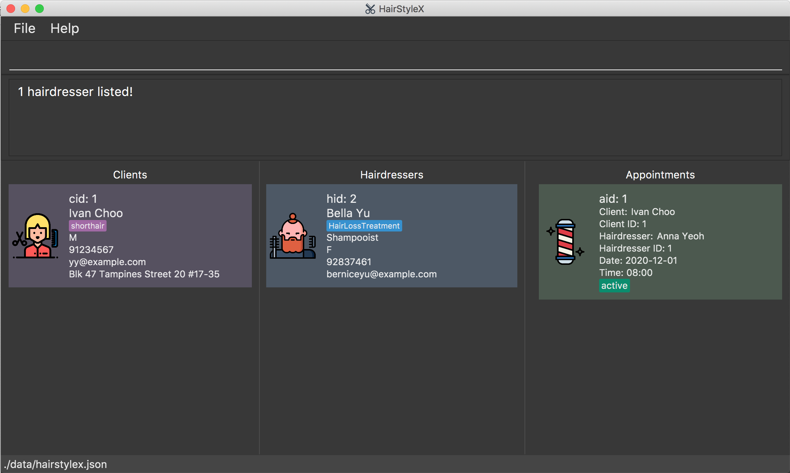

### 4.4 Appointment Management

(contributed by Nicholas Toh)

This feature allows you to manage appointments between hairdressers and clients. You can record the following information about appointments: 
* Client
* Hairdresser
* Date
* Time
* Status

#### 4.4.1 Appointment Management Command Parameters

Parameter Name | Description
--------|------------------
`CLIENT_ID` | The ID of the client `cid`
`HAIRDRESSER_ID` | The ID of the hairdresser `hid`
`DATE` | The date of the appointment.   It must be in the format of `YYYY-MM-DD`, following the ISO8601 standard.   E.g. `2020-12-13` This example means 13th December 2020.
`TIME` | The time of the appointment.   It must be in the format of `HH:MM`.   E.g. `17:30` This example means 5.30 pm.
`STATUS` | The status of the appointment, which can be `ACTIVE`, `COMPLETED`, or `MISSED`
`ID` | The appointment ID `aid` that represents the appointment.

#### 4.4.2 Adding an appointment : `add_appt`

You can use this command to add an appointment to the database.

**Format**: `add_appt cid/CLIENT_ID hid/HAIRDRESSER_ID d/DATE t/TIME`
* `CLIENT_ID` must be a valid client ID (cid)
* `HAIRDRESSER_ID` must be a valid hairdresser ID (hid)
* `DATE` must be entered in YYYY-MM-DD format
* `TIME` must be entered in 24 Hour HH:MM format

  

**:information_source: Notes about creating appointments**  

* All appointments are active by default.  

* All appointments have a duration of **2 hours**. Hence the end time of an appointment is implicitly two hours after the start time. This is because two hours is a reasonable time period required of for any hair treatment. If an appointment is completed earlier, the hairdresser can take charge of walk in customers. 

* Appointments involving the same persons (hairdresser or client) should not overlap in time. Equivalently, no person should be simultaneously involved in two appointments.  

* Appointments should only be created in the future.  

* Appointment IDs may not be in order.

**Example**:
In the example below, you will create an appointment between **client 1** and **hairdresser 1** on **12th December 2020** at **5.30pm**. (This assumes that the client and hairdresser currently exist.) You will perform the following steps:

Adding a new appointment:  

1. Type `add_appt cid/1 hid/2 d/2020-12-12 t/17:30` into the *Command Box*.
1. Press `Enter` to execute.

Outcome:  

1. The `Result Display` will show a success message.
1. You can now see information about the added appointment in the *Appointments Panel*.  
    * If you had previously filtered appointments (refer to [Section 4.4.6](#446-filtering-appointments--filter_appt)), the filter may be removed.

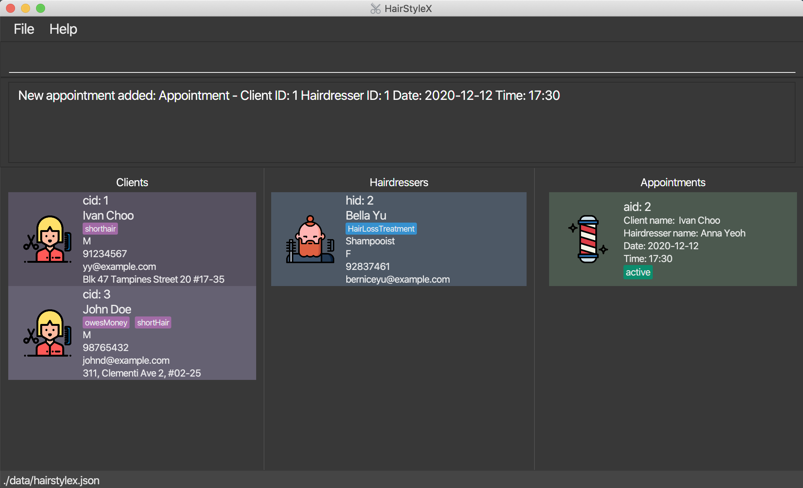

#### 4.4.3 Listing appointments : `list_appt`

You can use this command to show a list of all hairdressers in the database. This command is especially useful if you used `filter_appt` command to search for appointments - `list_appt` will restore the full list to view. 

**Format:**

`list_appt`

Assume that you have previously filtered the list of appointments, and now wish to view all appointments. You will perform the following steps:
**Example:**

Listing all appointments:  

1. Type `list_appt` into the *Command Box*.
1. Press `Enter` to execute.

Outcome:  

1. The `Result Display` will show a success message.
1. You can now see all appointments in the *Appointments Panel*.

#### 4.4.4 Editing an appointment : `edit_appt`

You can use this command to edit an existing appointment in the database.

**Format**: 

`edit_appt ID s/STATUS`

* Edits the appointment with the specified `ID`. 

* `CLIENT_ID` must be a valid appointment ID (aid)

* Only the status of the appointment can be updated. If you wish to change other aspects of an appointment, such as the client/hairdresser/time, simply delete the appointment and create a new one.

:information_source: 
* Edits the appointment with the specified `ID`. This refers to the appointment ID `aid` shown in the displayed appointment list. The index **must be a positive integer** 1, 2, 3, …
* The current status will be updated to reflect the new status.

**Example**:
Assume that an appointment with ID `2` was successfully completed. You wish to update the database to reflect this appointment as `COMPLETED`.  You will perform the following steps:

Editing an appointment:

1. Type `edit_appt 2 s/COMPLETED` into the *Command box*.
1. Press `Enter` to execute.

Outcome:

1. The `Result Display` will show a success message. 
1. You can now see the updated appointment information in the *Appointments Panel*.  
    * If you had previously filtered appointments (refer to [Section 4.4.6](#446-filtering-appointments--filter_appt)), the filter may be removed.

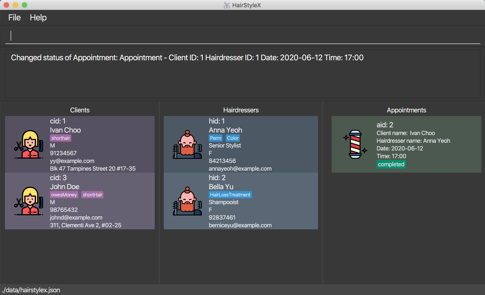

#### 4.4.5 Deleting an appointment : `delete_appt`

Removes a specific appointment from the database.

**Format**: 

 `delete_appt ID`

:information_source: 
* Deletes the appointment with the specified `ID`.
* The ID refers to the appointment ID `aid` shown in the displayed appointment list.
* The ID **must be a positive integer** 1, 2, 3, …

**Example**:

Assume that a client has contacted the salon to cancel the appointment with ID `2` so you wish to delete it. You will perform the following steps:

Delete appointment:  

1. Type `delete_appt 2` into the *Command Box*.
1. Press `Enter` to execute.

Outcome:  

1. The `Result Display` will show a success message.
1. The appointment will be removed from the *Appointments Panel*.  
    * If you had previously filtered appointments (refer to [Section 4.4.6](#446-filtering-appointments--filter_appt)), the filter may be removed.

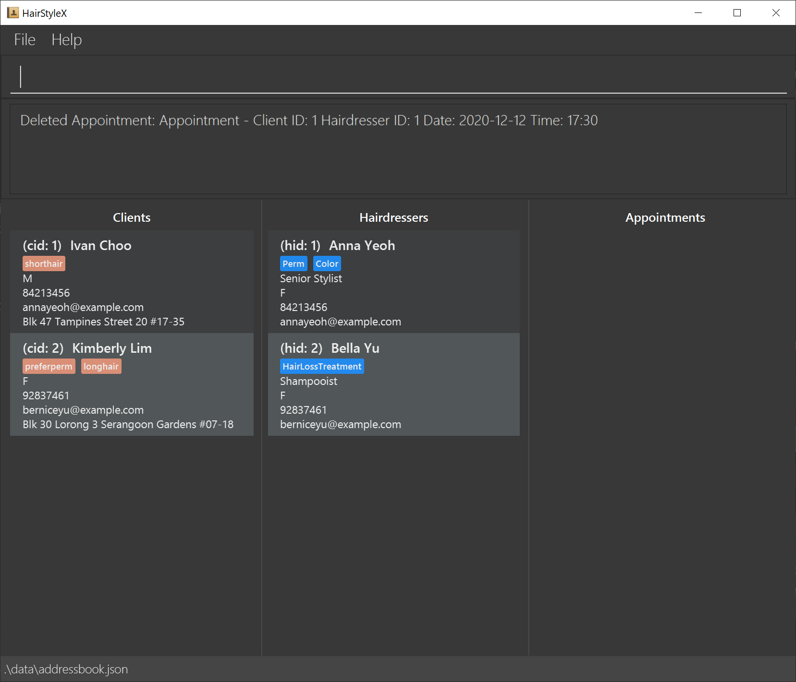

#### 4.4.6 Filtering appointments : `filter_appt`

You can filter the list of appointments in the database by keyword search that match their names.

**Format:**

 `filter_appt [cid/CLIENT_INDEX] [hid/HAIRDRESSER_INDEX] [d/DATE_OF_APPT] [s/APPT_STATUS]`

:information_source: 
* The search is case-insensitive. e.g `active`, `aCtIVe` will match `ACTIVE`.
* Only full words will be matched e.g. `ACTIV` will not match `ACTIVE`.
* `DATE_OF_APPT` and `APPT_STATUS` must be valid e.g. `2020-01-1` is not a valid `DATE` because it does not follow the format of `YYYY-MM-DD`.
* Only one input for each prefix is allowed e.g. `filter_appt cid/1 cid/2` is not a valid input.

**Example 1:**

You wish to find appointments with status `MISSED` in the database. You will perform the following steps:

Filter appointments:  

1. Type `filter_appt s/missed` into the *Command Box*.
1. Press `Enter` to execute.

Outcome:  

1. The `Result Display` will show a success message.
1. You can now see the filtered appointments in the *Appointments Panel*.

**Example 2:**

You wish to find appointments with date `2021-06-02` in the database. You will perform the following steps:

Filter appointments:  

1. Type `filter_appt d/2021-06-02` into the *Command Box*.
1. Press `Enter` to execute.

Outcome:  

1. The `Result Display` will show a success message.
1. You can now see the filtered appointments in the *Appointments Panel*.

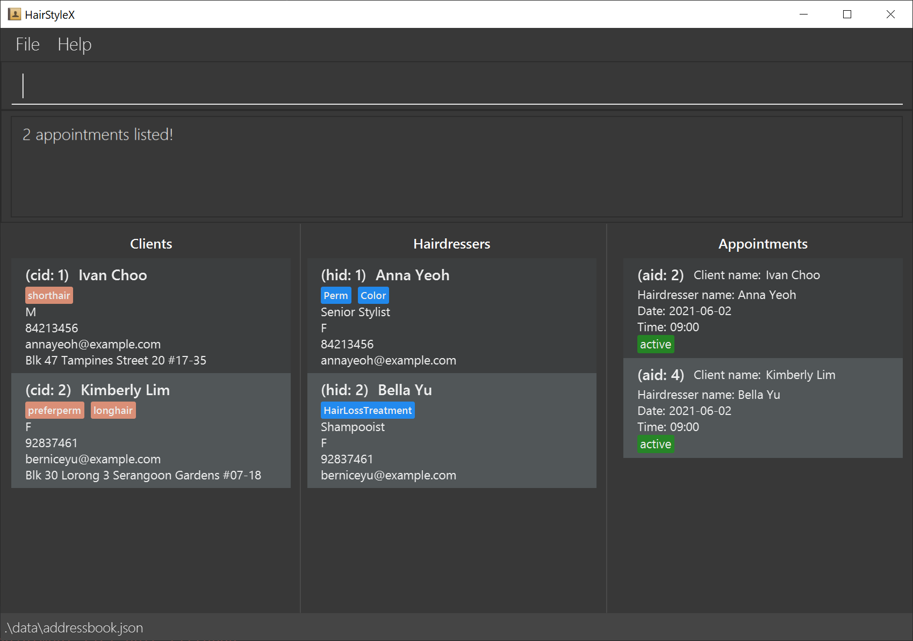

### 4.5 Shortcut commands
(Contributed by Aloysius)

This feature allows you to customise command shortcuts. You can add, delete and list shortcuts for 
longer commands.

#### 4.5.1 Shortcut Command Parameters

Parameter Name | Description
--------|------------------
`OLD_SHORTCUT` | The name of an original command provided by **HairStyleX**.  E.g. `add_client`, `edit_appt`, etc.
`NEW_SHORTCUT` | Your preferred shortcut name for the `OLD_SHORTCUT`. It should only contain at most 20 alphanumeric characters, hyphens `-`, or underscores `_`.  E.g. `a_c`, `ea`, `a-h`, etc.

#### 4.5.2 Add a new shortcut : `add_shortcut`

You can use this command to add a new shortcut to the program.

**Format:**

`add_shortcut old/OLD_SHORTCUT new/NEW_SHORTCUT`

**Example:**

You want to create a shortcut `aa` for `add_shortcut`. 

Creating a new shortcut:

* Type `add_shortcut old/add_shortcut new/aa` into the _Command Box_.
* Press `Enter` to execute.

Outcome:

* The _Result Display_ will show a success message.
* You can now see your new shortcut.

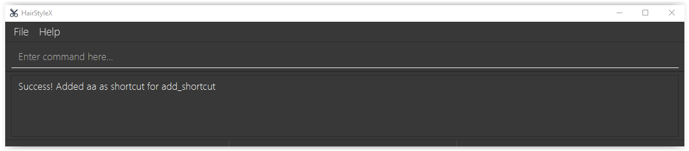

You can now use the shortcut
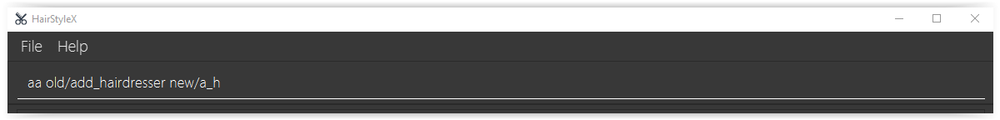

And it works!
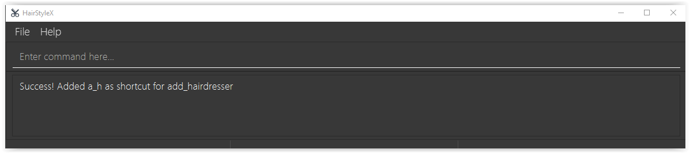

  

**:information_source: You cannot add duplicate shortcuts or default command words as shortcuts. You also can still use the original command!** 

#### 4.5.2 Delete a shortcut: `delete_shortcut`

You can use this command to delete a shortcut to the program.

**Format:**

`delete_shortcut SHORTCUT`

**Example:**

You want to delete a shortcut `aa`. 

Deleting a shortcut:

* Type `delete_shortcut aa` into the _Command Box_.
*  Press `Enter` to execute.

Outcome:

* The _Result Display_ will show a success message.

.Outcome of a successful `delete_shortcut` command
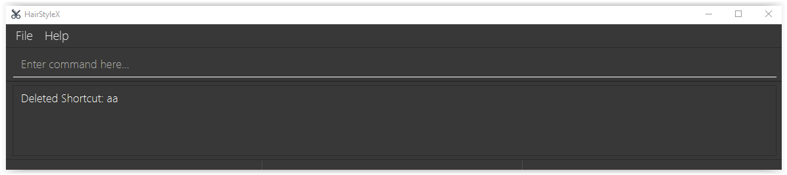

#### 4.5.3 List all shortcuts : `list_shortcut`

You can use this command to list all your shortcuts.

*Format:*

`list_shortcut`

You can use this command to show all your shortcuts.

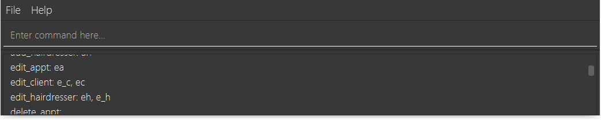

## 5. FAQ
(Contributed by Tan Yu Li, James)

**Q**: How do I transfer my data to another Computer? 
**A**: Install the app in the other computer and overwrite the empty data file it creates with the file that contains the data of your previous **HairStyleX** home folder.

**Q**: Why aren’t I allowed to edit my date or time for the appointment? 
**A**: Editing the date or time may cause conflicts in your schedule if the change results in two appointments with the same hairdresser occuring concurrently. However, we are working on a feature that will allow you to resolve these conflicts in the upcoming version of **HairStyleX**.

**Q**: What do I do if I want to change my appointment’s date or time since I cannot edit them? 
**A**: Unfortunately, you have to delete the appointment and create a new one.

**Q**: What happens if I schedule 2 of my appointments with the same hairdresser on the same date and time? Will **HairStyleX** detect it? 
**A**: Yes, **HairStyleX** will detect such cases and prevent you from creating such an appointment.

--------------------------------------------------------------------------------------------------------------------

## 6. Command summary

(Contributed by Tan Yu Li, James)

### 6.1 General Commands

Action | Format, Examples
--------|------------------
**View user guide** | `help`
**Clear all entries** | `clear`
**Exit the application** | `exit`
**Export to CSV** | `print`

### 6.2 Client Commands

Action | Format, Examples
--------|------------------
**Add Client** | `add_client n/NAME p/PHONE_NUMBER e/EMAIL g/GENDER a/ADDRESS [t/TAG]…`   e.g., `add_client n/Nicholas Toh p/12345678 e/niktoh@example.com g/M a/123, Clementi Rd, 1234665 tr/colouring p/female stylist t/frequent`
**List Clients** | `list_client`
**Edit Client** | `edit_client ID [n/NAME] [p/PHONE_NUMBER] [e/EMAIL] [g/GENDER] [a/ADDRESS] [t/TAG]…`  e.g.`edit_client 2 n/James Tan p/Female Stylist`
**Delete Client** | `delete_client ID`   e.g. `delete_client 3`
**Filter Client** | `filter_client KEYWORD...`

### 6.3 Hairdresser Commands

Action | Format, Examples
--------|------------------
**Add Hairdresser** | `add_hairdresser n/NAME p/PHONE_NUMBER e/EMAIL g/GENDER ti/TITLE [s/SPECIALISATION]…`   e.g., `add_hairdresser n/James Ho p/22224444 e/jamesho@example.com g/M ti/senior s/colouring t/colleague`
**List Hairdressers** | `list_hairdresser`
**Edit Hairdresser** | `edit_hairdresser ID [n/NAME] [p/PHONE_NUMBER] [e/EMAIL] [ti/TITLE] [s/SPECIALISATION]…`  e.g.`edit_hairdresser 2 n/James Lee ti/senior`
**Delete Hairdresser** | `delete_hairdresser ID`   e.g. `delete_hairdresser 3`
**Filter Hairdresser** | `filter_hairdresser KEYWORD...`

### 6.4 Appointment Commands

Action | Format, Examples
--------|------------------
**Add Appointment** | `add_appt cid/CLIENT_ID hid/HAIRDRESSER_ID d/DATE t/TIME`   e.g. `add_appt cid/1 hid/1 d/2020-12-12 t/17:30`
**List Appointments** | `list_appt`
**Edit Appointment** | `edit_appt ID s/STATUS`   e.g. `edit_appt 1 s/COMPLETED`
**Delete Appointment** | `delete_appt ID`   e.g. `delete_appt 3`
**Filter Appointment** | `filter_appt [cid/CLIENT_INDEX] [hid/HAIRDRESSER_INDEX] [d/DATE_OF_APPT] [s/APPT_STATUS]`   e.g. `filter_appt s/missed`

### 6.5 Shortcut Commands

Action | Format, Examples
--------|------------------
**Add Shortcut** | `add_shortcut old/OLD_SHORTCUT new/NEW_SHORTCUT`   e.g. `add_shortcut old/add_shortcut new/aa`
**Delete Shortcut** | `delete_shortcut SHORTCUT`   e.g. `delete_shortcut aa`
**List Shortcut** | `list_shortcut`
