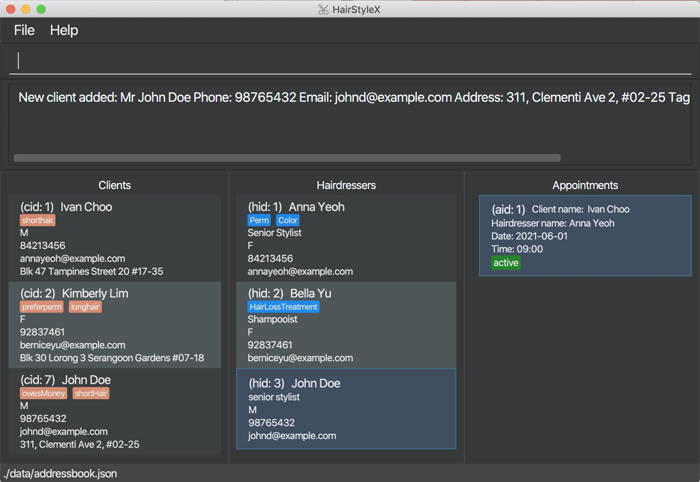
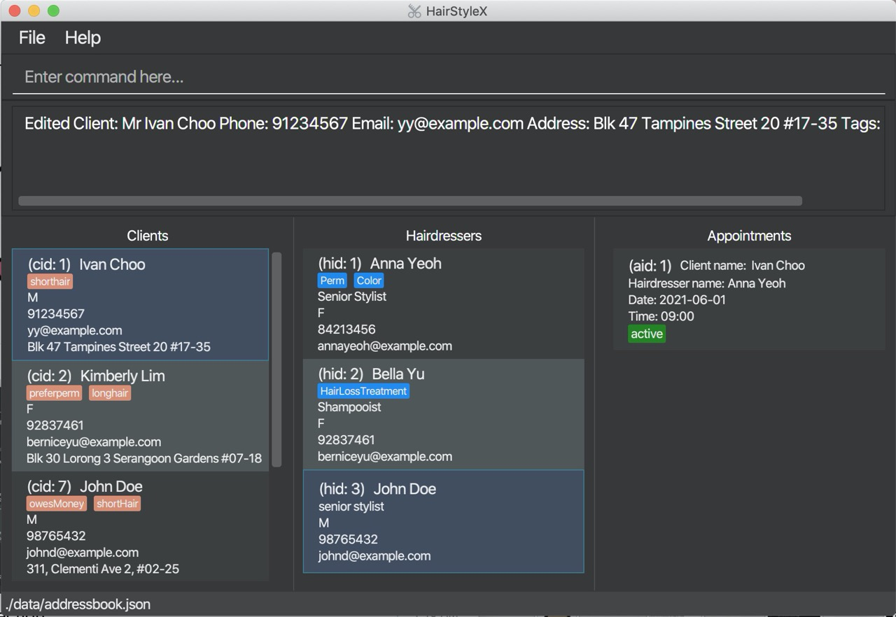
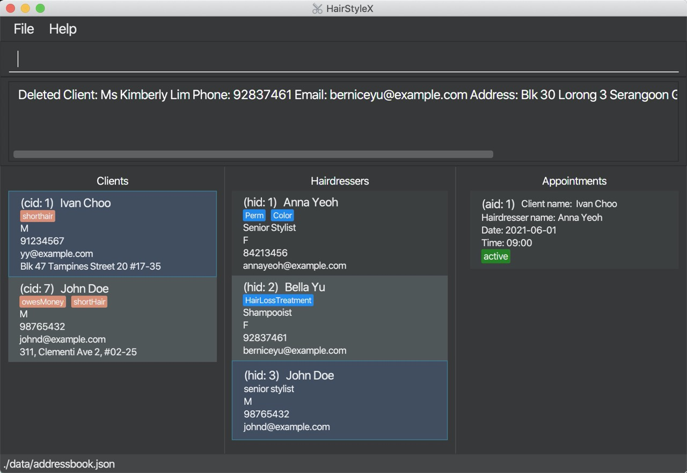
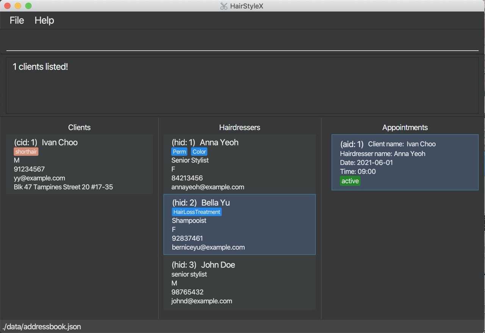

HairstyleX helps managers for budding neighborhood hair salons to manage clients, hairdressers, and appointments. It is optimized for CLI users so that frequent tasks can be done faster by typing in commands.
* Table of Contents
{:toc}

--------------------------------------------------------------------------------------------------------------------

## Quick start

1. Ensure you have Java `11` or above installed in your Computer.

1. Download the latest `HairStyleX.jar` from [here](https://github.com/AY2021S1-CS2103T-T15-1/tp/releases).

1. Copy the file to the folder you want to use as the _home folder_ for your HairStyleX.

1. Double-click the file to start the app. The GUI similar to the below should appear in a few seconds. Note how the app contains some sample data. 
   

1. Type the command in the command box and press Enter to execute it. e.g. typing **`help`** and pressing Enter will open the help window. 

1. Refer to the [Features](#features) below for details of each command.

--------------------------------------------------------------------------------------------------------------------

## Features

**:information_source: Notes about the command format:** 

* Words in `UPPER_CASE` are the parameters to be supplied by the user. 
  e.g. in `add n/NAME`, `NAME` is a parameter which can be used as `add n/John Doe`.

* Items in square brackets are optional. 
  e.g `n/NAME [t/TAG]` can be used as `n/John Doe t/friend` or as `n/John Doe`.

* Items with `…`​ after them can be used multiple times including zero times. 
  e.g. `[t/TAG]…​` can be used as ` ` (i.e. 0 times), `t/friend`, `t/friend t/family` etc.

* Parameters can be in any order. 
  e.g. if the command specifies `n/NAME p/PHONE_NUMBER`, `p/PHONE_NUMBER n/NAME` is also acceptable.

### General commands

#### Viewing help : `help`

Shows the link to the user guide in case the user forgets the commands.

#### Clearing all entries : `clear`

Clears all entries from the application.

Format: `clear`

#### Exiting the program : `exit`

Exits the program.

Format: `exit`

#### Saving the data

All hairdressers and client information will be stored automatically after any command that changes the data. There is no need to save manually. Will be loaded upon restart of the application.

### Appointment commands

#### Adding an appointment : `add_appt`

Adds an appointment to the database.

Format: `add_appt cid/CLIENT_ID hid/HAIRDRESSER_ID d/DATE t/TIME`
* `DATE` must be entered in YYYY-MM-DD format
* `TIME` must be entered in 24 Hour HH:MM format

Examples:
* `add_appt cid/1 hid/1 d/2020-12-12 t/17:30`

#### Listing all appointments : `list_appt`

Shows a list of all appointments in the database.

Format: `list_appt`

#### Editing an appointment : `edit_appt`

Edits an existing appointment in the database.

Format: `edit_appointment ID s/STATUS`

* Edits the appointment with the specified `ID`. The index refers to the index number shown in the displayed appointment list. The index **must be a positive integer** 1, 2, 3, …​
* Only the status of the appointment can be updated.
* All appointments are active by default.

Examples:
*  `edit_appt 1 s/CANCELLED` Edits the status of the first appointment to be CANCELLED.

#### Deleting an appointment : `delete_appt`

Removes a specific appointment from the database.

Format: `delete_appt ID`

* Deletes the appointment with the specified `ID`.
* The index refers to the index number shown in the displayed appointment list.
* The index **must be a positive integer** 1, 2, 3, …​

### 4.2 Client Management
(Contributed by Yao Yuan)

This feature allows you to manage the information of clients in your salon. You can record the following information about clients:

* Name
* Gender
* Phone
* Email
* Address
* Tags

#### 4.2.1 Client Management Command Parameters
Before you jump right into using this feature, you may want to learn about all the common command parameters used in this feature. The table below shows the list of common command parameters that will be used for this feature.

Parameter Name | Description
---------------|-------------
`NAME` | The name of the client.  It should only contain alphanumeric characters and spaces, and it should not be blank.   E.g. `Yao Yuan`
`PHONE` | The phone number of the client.   It should only contain numbers, and it should be at least 3 digits long   E.g. `96757525`
`EMAIL` | The email of the client. Emails should be of the format local-part@domain and adhere to the following constraints:  1. The local-part should only contain alphanumeric characters and these special characters: `!#$%&'*+/=?{}~^.-` . 2. This is followed by a '@' and then a domain name. The domain name must be at least 2 characters long, start and end with alphanumeric characters, consist of alphanumeric characters, a period or a hyphen for the characters in between, if any. E.g. `yaoyuan@example.com`
`GENDER` | The gender of the client.   Gender should be either F or M or f or m.   E.g. `F`
`ADDRESS` | The address of the client.    E.g. `6 College Avenue East #12-01D`
`TAG` | The tag of the client.   It should only contain alphanumeric characters.   It is optional.   There can be more than one tag for each client.   E.g. `shortHair`
`ID` | The unique client ID `cid` that is assigned to each client.  The ID is unique to each client, and the ID will not be assigned to another client even if one is deleted from the database.  Thus, the ID displayed in the list may not be sequential. 
`KEYWORD` | Keyword for `filter_client`.  It should only contain alphanumeric characters. 

#### 4.2.2 Adding a client: `add_client`

You can use this command to add a client to the database.

**Format:**

`add_client n/NAME p/PHONE e/EMAIL g/GENDER a/ADDRESS [t/TAG]…​`

:information_source: Refer to Section 4.2.1 for more details on each parameter.

**Examples:**

In the example below, you will register a male client called **John Doe** with phone number **98765432**, email **johnd@example.com**, address **311, Clementi Ave 2, #02-25**, who has short hair and owns the salon money, into the HairstyleX.

* `add_client n/John Doe p/98765432 e/johnd@example.com g/M a/311, Clementi Ave 2, #02-25 t/shortHair t/owesMoney`

Adding a new client:  

1. Type `add_client n/John Doe p/98765432 e/johnd@example.com g/M a/311, Clementi Ave 2, #02-25 t/shortHair t/owesMoney` into the *Command Box*.
1. Press `Enter` to execute.

Outcome:  

1. The `Result Display` will show a success message. 
1. You can now see the client's information in the *Clients Panel*.

*Figure 1. Outcome of a successful `add_client` command*

#### 4.2.3 Listing all clients : `list_client`

You can use this command to show a list of all clients in the database. This command is especially useful if you used `filter_client` command to search for clients- `list_client` will restore the full list to view. 

**Format:**

`list_client`

**Example:**

Listing all your clients:

1. Type `list_client` into the *Command Box*.
1. Press `Enter` to execute.

Outcome:

1. The Result Display will show a success message.
1. You can now see all your clients in the *Client Panel*.

#### 4.2.4 Editing a client : `edit_client`

You can use this command to edit an existing client in the database.

**Format:**
 
`edit_client ID [n/NAME] [p/PHONE] [e/EMAIL] [g/GENDER] [a/ADDRESS] [t/TAG]…​`

:information_source: 
* Edits the client with the specified `ID`. The index refers to the index number `cid` shown in the displayed client list. The index **must be a positive integer** 1, 2, 3, …​
* At least one of the optional fields must be provided.
* Existing values will be updated to the input values.
* When editing tags, the existing tags of the client will be removed i.e adding of tags is not cumulative.
* You can remove all the client’s tags by typing `t/` without
    specifying any tags after it.
* Refer to Section 4.2.1 for more details on each parameter.

**Examples:**

Assume that the client with ID `1` changed his/her email and you wish to update it in the database. You will perform the following steps:

Adding a new client:

1. Type `edit_client 1 p/91234567 e/yy@example.com` into the *Command box*.
1. Press `Enter` to execute.

Outcome:

1. The `Result Display` will show a success message. 
1. You can now see the updated client's information in the *Clients Panel*.

*Figure 2. Outcome of a successful `edit_client` command*

#### 4.2.5 Deleting a client : `delete_client`

You can use this command to remove a specific client from the database.

**Format:**

`delete_client ID`

:information_source: 
* Deletes the client with the specified `ID`.
* The index refers to the index number `cid` shown in the displayed client list.
* The index **must be a positive integer** 1, 2, 3, …​
* All appointments with this corresponding client will now show "DELETED" for the client placeholder

**Example:**

Assume that the information of client with ID `2` is no longer needed and you wish to delete him/her from the database. You will perform the following steps:

Delete client:  

1. Type `delete_client 2` into the *Command Box*.
1. Press `Enter` to execute.

Outcome:  

1. The `Result Display` will show a success message.

*Figure 3. Outcome of a successful `delete_Client` command*

#### 4.2.6 Filtering clients : `filter_client`

You can filter the list of clients in the database by keyword search that match their names.

**Format:**

 `filter_client KEYWORD...`

:information_source: 
* The search is case-insensitive. e.g `anna`, `aNNa` will match `Anna`.
* The order of the keywords does not matter. e.g. `Anna Yeoh` will match `Yeoh Anna`.
* Only the name is searched.
* Only full words will be matched e.g. `Ann` will not match `Anna`.
* Persons matching at least one keyword will be returned (i.e. `OR` search). e.g. `Anna Yeoh` will return `Anna Cheung`, `David Yeoh`.

**Example:**

You wish to find the client **Ivan** from the database and check his phone number. You will perform the following steps:

Filter clients:  

1. Type `filter_client ivan` into the *Command Box*.
1. Press `Enter` to execute.

Outcome:  

1. The `Result Display` will show a success message.
1. You can now see the filtered client's information in the *Clients Panel*, with clients named `Ivan` displayed in the list.

*Figure 4. Outcome of a successful `filter_client` command*

### Hairdresser commands

#### Adding a hairdresser : `add_hairdresser`

Adds a hairdresser to the database.

Format: `add_hairdresser n/NAME p/PHONE_NUMBER e/EMAIL g/GENDER ti/TITLE [s/SPECIALISATION]…​`

#### Listing all hairdressers : `list_hairdresser`

Shows a list of all hairdressers in the database.

Format: `list_hairdresser`

Format: `list_client`

#### Editing a hairdresser : `edit_hairdresser`

Edits an existing hairdresser in the database.

Format: `edit_hairdresser ID [n/NAME] [p/PHONE] [e/EMAIL] [e/GENDER] [ti/TITLE] [s/SPECIALISATION]…​`

* Edits the hairdresser with the specified `ID`. The index refers to the index number shown in the displayed hairdresser list. The index **must be a positive integer** 1, 2, 3, …​
* At least one of the optional fields must be provided.
* Existing values will be updated to the input values.
* When editing specialisations, the existing specialisations of the hairdresser will be removed i.e adding of specialisations is not cumulative.
* You can remove all the hairdresser’s tags by typing `s/` without
    specifying any specialisations after it.

Examples:
*  `edit_hairdresser 1 p/91234567 e/yy@example.com` Edits the phone number and email address of the 1st hairdresser to be `91234567` and `yy@example.com` respectively.
*  `edit_hairdresser 2 n/Betsy Crower s/` Edits the name of the 2nd hairdresser to be `Betsy Crower` and clears all existing specialisations.

#### Deleting a hairdresser : `delete_hairdresser`

Removes a specific hairdresser from the database.

Format: `delete_hairdresser ID`

* Deletes the hairdresser with the specified `ID`.
* The index refers to the index number shown in the displayed hairdresser list.
* The index **must be a positive integer** 1, 2, 3, …​
* All appointments with this corresponding hairdresser will now show "DELETED" for the hairdresser placeholder

### Alias commands

#### Adding a command alias : `add_alias`

Adds a new command alias to the database.

Format: `add_alias old/OLD_ALIAS new/NEW_ALIAS`

#### Deleting a command_alias : `delete_alias`

Removes a command alias from the database.

Format: `delete_alias ALIAS`

## FAQ

**Q**: How do I transfer my data to another Computer? 
**A**: Install the app in the other computer and overwrite the empty data file it creates with the file that contains the data of your previous HairstyleX home folder.

--------------------------------------------------------------------------------------------------------------------

## Command summary

Action | Format, Examples
--------|------------------
**Help** | `help`
**Clear** | `clear`
**Exit** | `exit`
**Add Hairdresser** | `add_hairdresser n/NAME p/PHONE_NUMBER e/EMAIL ti/TITLE [s/SPECIALISATION] [t/TAG]…​`   e.g., `add n/James Ho p/22224444 e/jamesho@example.com ti/senior s/colouring t/colleague`
**Add Client** | `add_client n/NAME p/PHONE_NUMBER e/EMAIL a/ADDRESS tr/TREATMENT [p/PREFERENCE] [t/TAG]…​`   e.g., `add n/Nicholas Toh p/12345678 e/niktoh@example.com a/123, Clementi Rd, 1234665 tr/colouring p/female stylist t/frequent`
**Add Appointment** | `add_appt cid/CLIENT_ID hid/HAIRDRESSER_ID d/DATE t/TIME`   e.g., `add_appt cid/1 hid/1 d/2020-12-12 t/17:30`
**List Hairdressers** | `list_hairdresser`
**List Clients** | `list_client`
**List Appointments** | `list_appt`
**Edit Hairdresser** | `edit_hairdresser ID ID [n/NAME] [p/PHONE_NUMBER] [e/EMAIL] [ti/TITLE] [s/SPECIALISATION] [t/TAG]…​`  e.g.,`edit_hairdresser 2 n/James Lee ti/senior`
**Edit Client** | `edit_client ID [n/NAME] [p/PHONE_NUMBER] [e/EMAIL] [a/ADDRESS] [tr/TREATMENT] [p/PREFERENCE] [t/TAG]…​`  e.g.,`edit_client 2 n/James Tan p/Female Stylist`
**Edit Appointment** | `edit_appointment ID s/STATUS`   e.g.,`edit_appt 1 s/CANCELLED`
**Delete Hairdresser** | `delete_hairdresser ID`   e.g., `delete_hairdresser 3`
**Delete Client** | `delete_client ID`   e.g., `delete_client 3`
**Delete Appointment** | `delete_appt ID`   e.g., `delete_appt 3`
